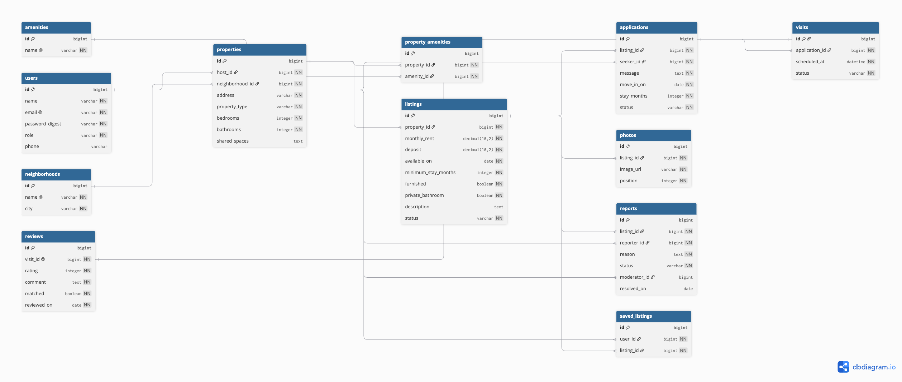

# Roomies — Domain Model

## Diagram



## DBML

Produced in [dbdiagram.io](https://dbdiagram.io); it compiles as it stands. The types
are the ones the Rails schema will use in Assignment 2. `note:` values list the states
each lifecycle column may hold.

```dbml
Table users {
  id bigint [primary key]
  name varchar [not null]
  email varchar [not null, unique]
  password_digest varchar [not null]
  role varchar [not null, note: 'member or moderator']
  phone varchar
}

Table neighborhoods {
  id bigint [primary key]
  name varchar [not null, unique]
  city varchar [not null]
}

Table amenities {
  id bigint [primary key]
  name varchar [not null, unique]
}

Table properties {
  id bigint [primary key]
  host_id bigint [not null]
  neighborhood_id bigint [not null]
  address varchar [not null]
  property_type varchar [not null]
  bedrooms integer [not null]
  bathrooms integer [not null]
  shared_spaces text
}

Table property_amenities {
  id bigint [primary key]
  property_id bigint [not null]
  amenity_id bigint [not null]

  indexes {
    (property_id, amenity_id) [unique]
  }
}

Table listings {
  id bigint [primary key]
  property_id bigint [not null]
  monthly_rent decimal(10,2) [not null]
  deposit decimal(10,2) [not null]
  available_on date [not null]
  minimum_stay_months integer [not null]
  furnished boolean [not null]
  private_bathroom boolean [not null]
  description text
  status varchar [not null, note: 'Draft, Published, Reserved, Rented, Withdrawn']
}

Table photos {
  id bigint [primary key]
  listing_id bigint [not null]
  image_url varchar [not null]
  position integer [not null]
}

Table applications {
  id bigint [primary key]
  listing_id bigint [not null]
  seeker_id bigint [not null]
  message text [not null]
  move_in_on date [not null]
  stay_months integer [not null]
  status varchar [not null, note: 'Pending, Shortlisted, Accepted, Rejected, Withdrawn']

  indexes {
    (listing_id, seeker_id) [unique]
  }
}

Table visits {
  id bigint [primary key]
  application_id bigint [not null]
  scheduled_at datetime [not null]
  status varchar [not null, note: 'Proposed, Confirmed, Cancelled, Completed']
}

Table reviews {
  id bigint [primary key]
  visit_id bigint [not null, unique]
  rating integer [not null, note: '1 to 5']
  comment text [not null]
  matched boolean [not null]
  reviewed_on date [not null]
}

Table reports {
  id bigint [primary key]
  listing_id bigint [not null]
  reporter_id bigint [not null]
  reason text [not null]
  status varchar [not null, note: 'Pending, Reviewed, Dismissed, ActionTaken']
  moderator_id bigint
  resolved_on date
}

Table saved_listings {
  id bigint [primary key]
  user_id bigint [not null]
  listing_id bigint [not null]

  indexes {
    (user_id, listing_id) [unique]
  }
}

Ref: properties.host_id > users.id
Ref: properties.neighborhood_id > neighborhoods.id
Ref: property_amenities.property_id > properties.id
Ref: property_amenities.amenity_id > amenities.id
Ref: listings.property_id > properties.id
Ref: photos.listing_id > listings.id
Ref: applications.listing_id > listings.id
Ref: applications.seeker_id > users.id
Ref: visits.application_id > applications.id
Ref: reviews.visit_id - visits.id
Ref: reports.listing_id > listings.id
Ref: reports.reporter_id > users.id
Ref: reports.moderator_id > users.id
Ref: saved_listings.user_id > users.id
Ref: saved_listings.listing_id > listings.id
```

## Relationships and cardinality

- A **user** hosts many **properties**; a property has one host. (1–N)
- A **neighborhood** groups many **properties**; a property sits in one neighborhood. (1–N)
- A **property** offers many **amenities** and an amenity belongs to many properties,
  through **property_amenities**. (N–M)
- A **property** has many **listings** over time; a listing belongs to one property. (1–N)
- A **listing** has many **photos**; a photo belongs to one listing. (1–N)
- A **listing** receives many **applications**, and a **user** (seeker) sends many
  applications; **applications** is the association between users and listings and
  carries its own message, dates and state. (N–M with data)
- An **application** has many **visits** over time; a visit belongs to one application. (1–N)
- A **visit** has at most one **review**; a review belongs to exactly one completed
  visit. (1–1)
- A **listing** collects many **reports**; a **user** files many reports and a
  **moderator** (a user) resolves many; each report points at one listing, one
  reporter and at most one moderator. (1–N)
- A **user** saves many **listings** and a listing is saved by many users, through
  **saved_listings**. (N–M)
